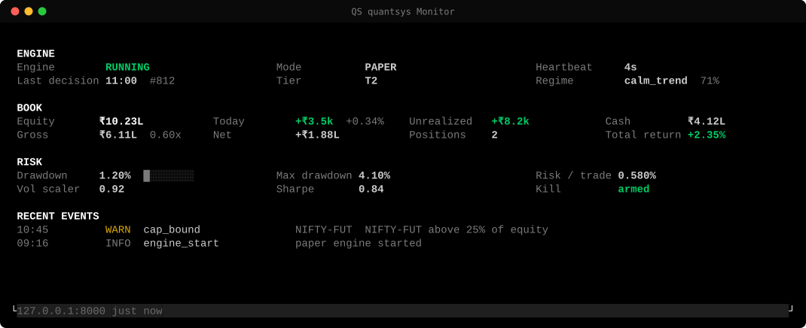
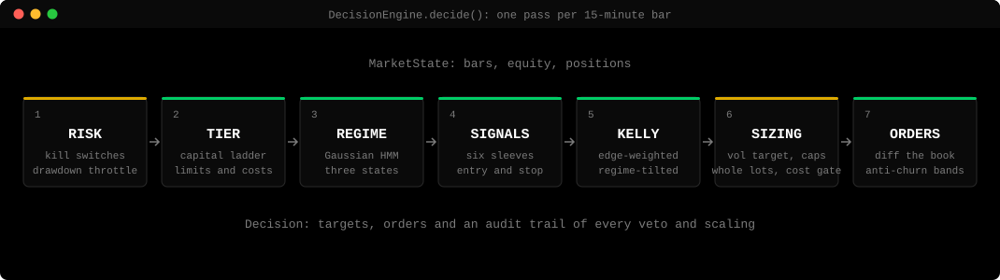
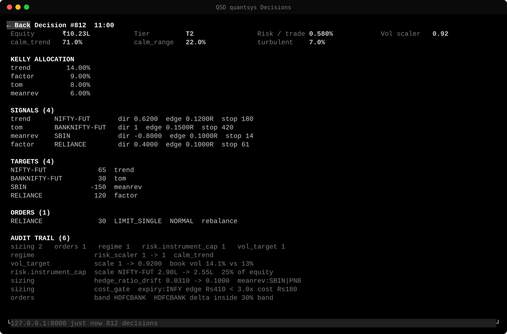
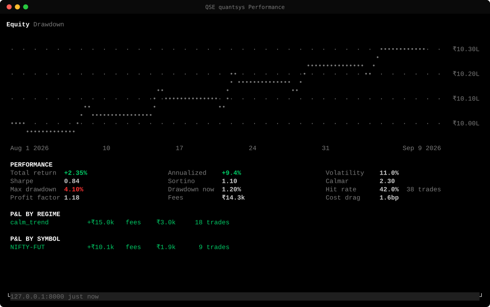
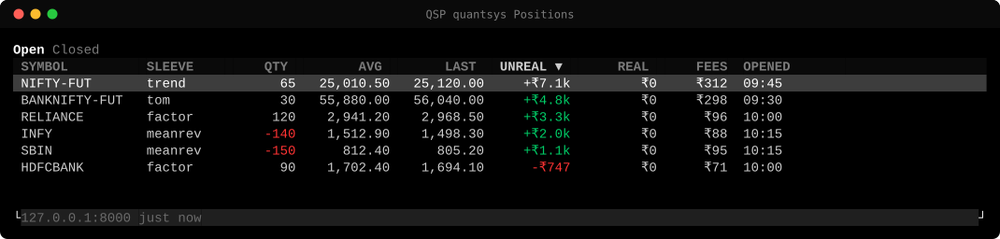
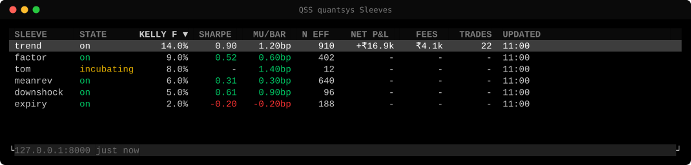

# quantsys

**Systematic trading for NSE equities and index futures**

A deterministic decision engine, an operator dashboard and a Bloomberg-style terminal.

 

 

One method, `DecisionEngine.decide()`, runs the backtester, the paper engine and the live engine. 
A result from one path holds for the others.

 

## How a decision is made

Every veto and every scaling lands in the decision's audit trail. 
[Architecture](docs/ARCHITECTURE.md) has each stage and the reasoning behind it.

 

## The terminal

A read-only monitor inside [Gloomberb](https://github.com/gloom-sh/gloomberb), opened by mnemonic from the command bar.

<table>
  <tr>
    <td align="center" width="50%">
       
      <b>QSD</b> &nbsp; every decision, from regime to audit trail
    </td>
    <td align="center" width="50%">
       
      <b>QSE</b> &nbsp; equity, drawdown, Sharpe and attribution
    </td>
  </tr>
  <tr>
    <td align="center" width="50%">
       
      <b>QSP</b> &nbsp; positions, and why each one entered and exited
    </td>
    <td align="center" width="50%">
       
      <b>QSS</b> &nbsp; each sleeve's Kelly fraction, edge and P&amp;L
    </td>
  </tr>
</table>

Also <b>QS</b> monitor &nbsp;·&nbsp; <b>QSO</b> orders and fills &nbsp;·&nbsp; <b>QSR</b> risk and caps &nbsp;·&nbsp; <b>QSB</b> backtests against the live gate &nbsp;·&nbsp; <b>QSC</b> connect. 
Rendered by Gloomberb from demo data.

 

## Strategy sleeves

| Sleeve | Rule | |
|:--|:--|:--:|
| trend | EMA 20/80 spread with a 55-bar breakout | on |
| meanrev | Same-sector cointegrated pairs, enter at \|z\| 2 | on |
| factor | 12-1 momentum and low volatility, long-short, monthly | on |
| expiry | Fade deviations in the last seven days of the month | on |
| downshock | Short after a 3.5-sigma down day on double volume | on |
| tom | Long index futures across the turn of the month | on |
| reversal | Short-term cross-sectional reversal | off |
| voloptions | Option verticals on implied against realized volatility | off |

48 NSE large caps, NIFTY and BANKNIFTY futures, on 15-minute bars. Every parameter lives in [config/base.yaml](config/base.yaml).

 

## Risk

| 0.6% | 13% | 18% | 20% | 2.5% |
|:--:|:--:|:--:|:--:|:--:|
| risk per trade | volatility target | drawdown throttle to zero | hard kill, manual re-arm | daily loss stop |

Exposure caps per instrument, sector, correlated cluster, net and margin are re-checked on the final lot-rounded book. 
A mismatch with the broker's book freezes all orders.

Live trading stays locked until a real-data backtest clears **OOS Sharpe 0.8, deflated Sharpe 0.95 and P(SR&lt;0) 0.10**, 
the broker is connected, `QS_LIVE_ARMED` is set outside the UI, and the operator re-authenticates.

 

## Status

Paper only. The 2016 to 2026 research found no rule that beats the index after costs ([closeout](docs/RESEARCH_CLOSEOUT.md), [unseen-data check](reports/unseen_check_2026-09-27.md)). 
A pre-registered forward study has run on paper since 2026-07-02 ([registration](docs/FORWARD_STUDY_2.md)).

 

## Built with

Python &nbsp;·&nbsp; NumPy &nbsp;·&nbsp; pandas &nbsp;·&nbsp; SciPy &nbsp;·&nbsp; statsmodels &nbsp;·&nbsp; FastAPI &nbsp;·&nbsp; SQLAlchemy &nbsp;·&nbsp; PostgreSQL &nbsp;·&nbsp; TimescaleDB &nbsp;·&nbsp; Redis &nbsp;·&nbsp; Next.js &nbsp;·&nbsp; React &nbsp;·&nbsp; TypeScript &nbsp;·&nbsp; Bun &nbsp;·&nbsp; Docker

 

## Documentation

[Architecture](docs/ARCHITECTURE.md) &nbsp;·&nbsp; [Development](docs/DEVELOPMENT.md) &nbsp;·&nbsp; [Deployment](docs/DEPLOY.md) &nbsp;·&nbsp; [Go-live](docs/GOLIVE.md) &nbsp;·&nbsp; [Operations](docs/OPS_RUNBOOK.md) &nbsp;·&nbsp; [Environment](docs/ENVIRONMENT.md) &nbsp;·&nbsp; [Security](SECURITY.md) &nbsp;·&nbsp; [Changelog](CHANGELOG.md)

 

Copyright © 2026 devpilotX. All rights reserved. Published for viewing only; see [LICENSE](LICENSE). Not investment advice.

